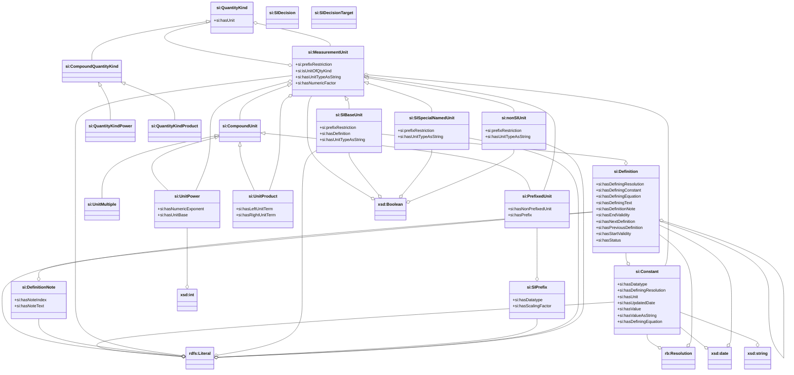
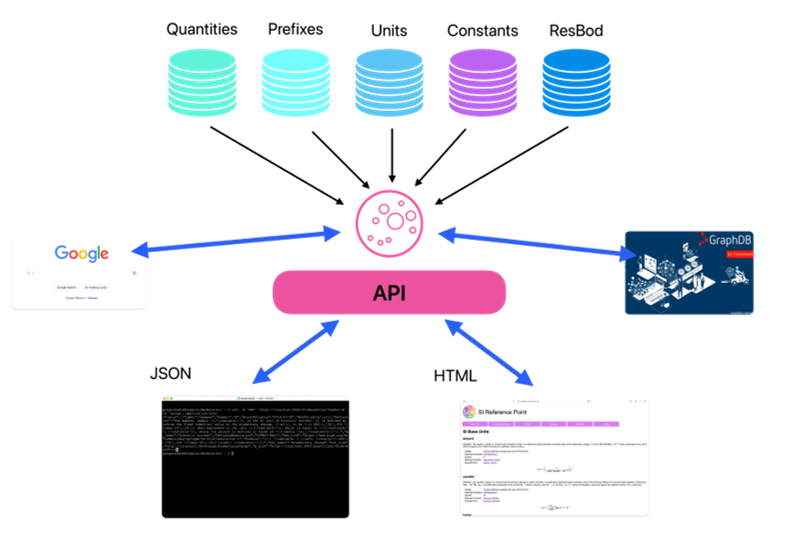
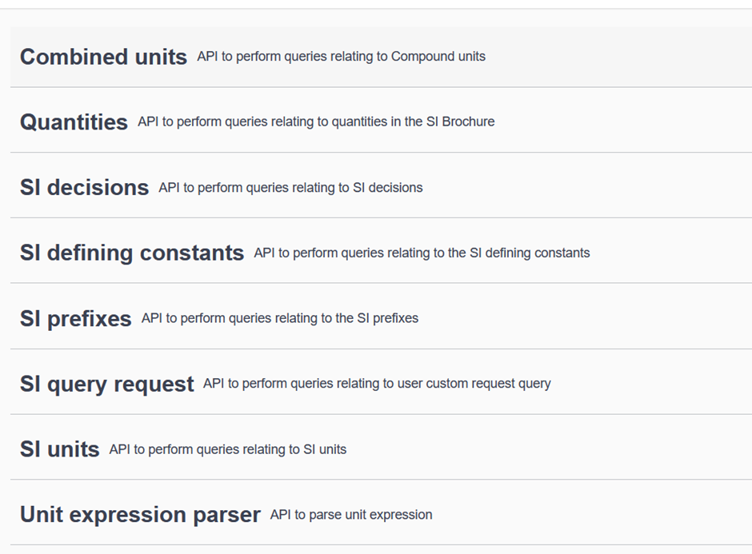
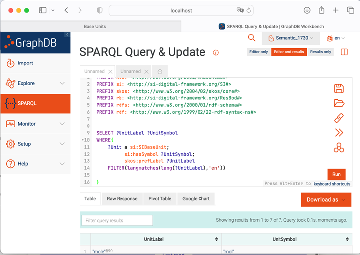

# The SI Reference Point

## 1. Scope

The [SI Reference Point](http://si-digital-framework.org/SI) is a set of tools making the information of the SI Brochures available in machine-readable form, designed to provide an authoritative digital reference for the [International System of Units (SI)](https://www.bipm.org/measurement-units/). The present document provides a general overview for users. A more detailed description of the Application Programming Interface (API) and underlying knowledge graph files is provided on our GitHub site (see Annex 1).

The present document is structured as follows:
*	Section 2 shows the information covered by the SI Reference Point.
*	Section 3 shows the data model used to encode the information.
*	Section 4 briefly indicates how the information can be browsed.
*	Section 5 summarizes the next steps.
*	Annex 1 lists the Classes and Predicates in the data model

## 2. Information contained in the SI Reference Point

The SI Reference Point is based on five main pillars, or knowledge graphs:
1. **[SI/units](http://si-digital-framework.org/SI/units)**
    * SI base units (Table 2 of [2])
    * SI derived units with special names (Table 4 of [2])
    * Non-SI units allowed for use with the SI (Table 8 of [2])
    * Compound units (the examples given in Tables 5 and 6 of [2] plus additional examples from the BIPM key comparison database (KCDB))
1. **[SI/prefixes](http://si-digital-framework.org/SI/prefixes)**
    * SI prefixes (Table 7 of [2])
1. **[SI/decisions](http://si-digital-framework.org/SI/decisions)**
    * Decisions relating to the SI, taken by the CGPM and CIPM  (Appendix 1 of [2])
1. **[Constants](http://si-digital-framework.org/constants)**
    * Initially the 7 defining constants of the SI (Table 1 of [2])
1.	**[Quantities](http://si-digital-framework,org/quantities)**
    * SI base quantities (Table 3 of [2])
    * Other example quantities (Tables 5 and 6 of [2])
    * Other quantities in the BIPM key comparison database (KCDB))
  
The SI/decisions information is presented in a stand-alone file, but interfaces with another component of the SI Digital Framework under development:

6. Responsible bodies
    * CGPM, CIPM, etc.

A tool is provided to allow for machine-encoding and interpretation of prefixed and other combined units (µm, m2, <nobr>m s-1, etc.).
  
**Table 1.** List of tables in the SI Brochure [2] and corresponding information in the SI Reference Point

| Table | Title | Encoded in|
| :----- | :----- | :---- |
| 1 |  The seven defining constants of the SI and the seven corresponding units they define  | constants |
| 2 | SI base units | SI/units |
| 3 |  Base quantities and dimensions  used in the SI | quantities |
| 4 |  The 22 SI units with special names and symbols | SI/units |
| 5 |  Examples of coherent derived units in the SI expressed in terms of base units | SI/units |
| 6 |  Examples of SI coherent derived units whose names and symbols include SI coherent derived units with special names and symbol | SI/units |
| 7 |  SI prefixes | SI/prefixes|
| 8 |  Non-SI units accepted for use with the SI units | SI/units |
| <nobr>App. 1</nobr> |  Decisions of the CGPM and the CIPM | SI/decisions |

## 3. Data model

The information contained in the nine editions of the SI Brochure has been encoded semantically and made publicly available on the internet at:

[si-digital-framework.org/SI](http://si-digital-framework.org/SI) 

The figure below shows the data model developed for this purpose. For a full list of the classes and predicates please refer to the GitHub site (see Annex 1).

## 4. Browsing the knowledge graphs

### General

The set of knowledge graphs are presented in the form of TTL files, which can be browsed by different means as outlined below. As they are interlinked, the five TTL files should be available together for parsing by the chosen application. The information can then be displayed and exploited according to the services offered by the application.

Following standard practice, the TTL files are divided between a “T-box”, specifying the data model at the “SI” level, and “A-boxes”, specifying the data entries at the “units”, “prefixes” and “decisions” levels.

### Application Programming Interface (API)

The web interface at https://si-digital-framework.org/SI is designed to simplify access to the knowledge graphs for a human reader. Underpinning the web pages are a set of pre-programmed calls to the TTL files, such as (expressed as words rather than data requests) “list all the SI units”, “list all the SI prefixes”, “what is the current definition of the metre”, etc. 

The same pre-programmed queries (API calls) are documented in the Swagger interface at
[https://si-digital-framework.org/api-docs/swagger-ui](https://si-digital-framework.org/api-docs/swagger-ui)

Select the service `SI REFERENCE POINT` from the drop-down menu at the top right of the screen.

The responses will be given according to the header information, which can be modified manually from a Command Line Interface if desired. For example: 
* `-H ‘accept:application/json’`	will return JSON code
* `-H ‘accept:application/xml’`	will return XML code
* `-H ‘accept:application/octet-stream’`	will return the response without change of format (i.e. in TTL)
 

### SPARQL endpoint

The TTL files can also be interrogated directly either using the [SPARQL endpoint](http://si-digital-framework.org/SI/query?lang=en) provided or via a human-friendly tool such as GraphDB. 

As an example, to browse the files visually using GraphDB:
* Download the (free) (GraphDB Desktop software)[https://www.ontotext.com/products/graphdb/] and install it on your computer.
* Create a new repository, e.g. SI-MMDD, based on:

  * PREFIX skos: <http://www.w3.org/2004/02/skos/core#>
  * PREFIX si: <http://si-digital-framework.org/SI#>   
  * PREFIX units: <http://si-digital-framework.org/SI/units/>
  * PREFIX prefixes: <http://si-digital-framework.org/SI/prefixes/>
  * PREFIX decisions: <http://si-digital-framework.org/SI/decisions/>
  * PREFIX constants: <http://si-digital-framework.org/constants/>
  * PREFIX quantities: <http://si-digital-framework.org/quantities/>

GraphDB also provides an interface for visual exploration of the knowledge graphs.

## 5. Next steps

This beta version of the SI Reference Point is open for comment, but it is hoped that the PIDs given here for the units defined in the SI can now be inserted into existing systems for representing units (such as QUDT, UnitsML, etc.), and used in other services under development. 

The list of kinds of quantity will gradually be extended to cover all the quantities included in the BIPM key comparison database (KCDB). 

To increase interoperability, authoritative external digital references for the listed quantities should be built in (such as from the the [e-ILV](https://cie.co.at/e-ilv), the [IEV](https://electropedia.org/), and the [IUPAC Gold Book](https://goldbook.iupac.org/). Currently this has been done for just a few of the quantities, as examples. The ongoing task to identify appropriate external references for the quantities will be carried out in collaboration with the subject experts in the CIPM’s Consultative Committees.

### Acknowlegements

This project was undertaken as part of the BIPM's Work Programme in Digital Transformation, with contributions from seconding NMIs.

Janet Miles (Head of Digital Transformation, BIPM) thanks in particular the following colleagues (listed alphabetically), who all made invaluable contributions:

* Amin Ben Abdallah
* Stuart Chalk (UNF)
* Gregor Dudle (METAS, now OST)
* Maximilian Gruber (PTB)
* Jean-Laurent Hippolyte (NPL)
* Frédéric Meynadier (BIPM)

## Annex 1:	List of Classes and Predicates

See [this separate page](./vocabulary.md)

